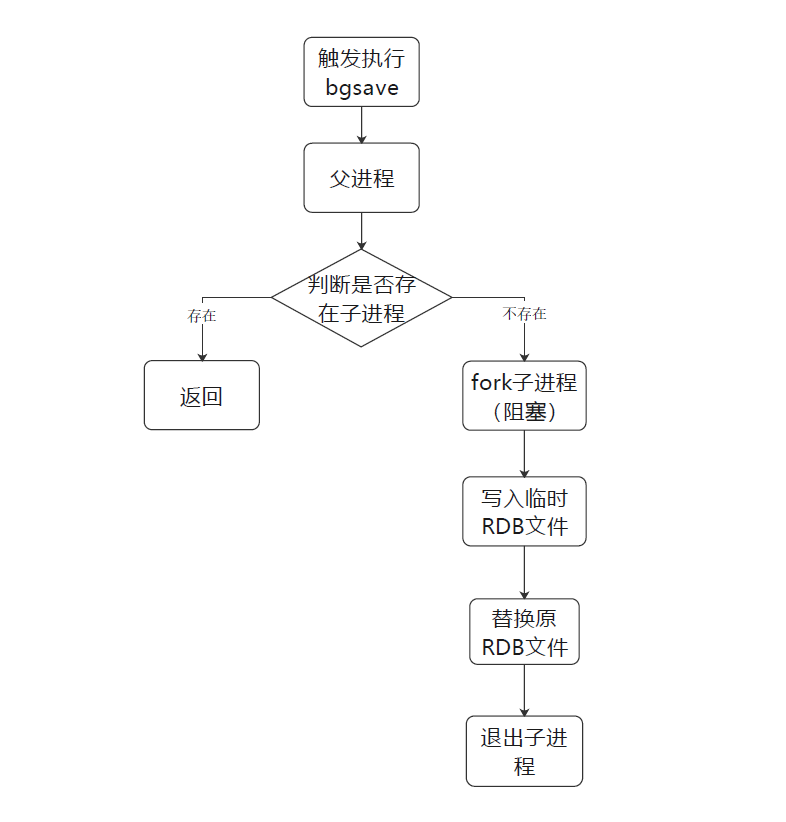
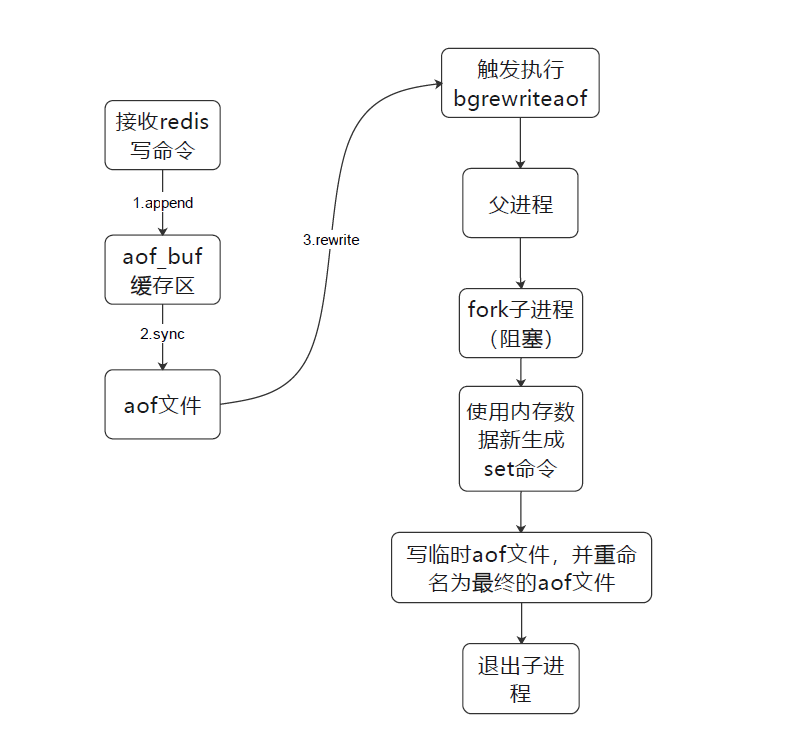
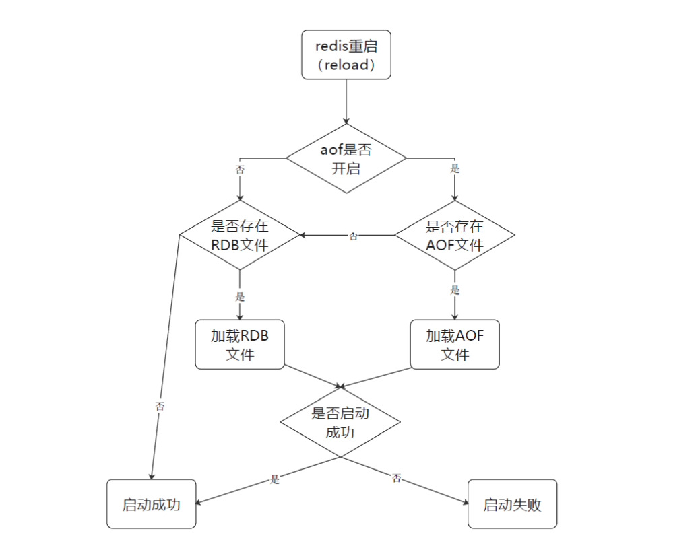
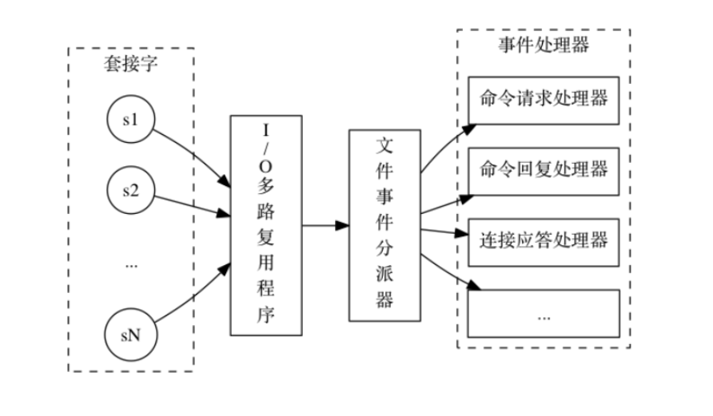
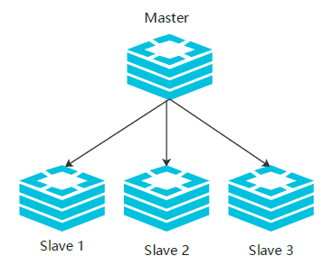
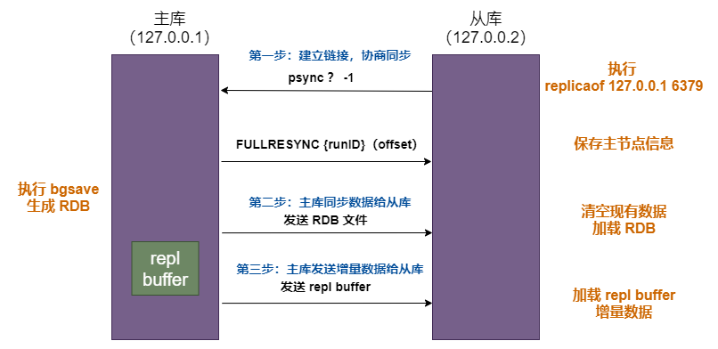
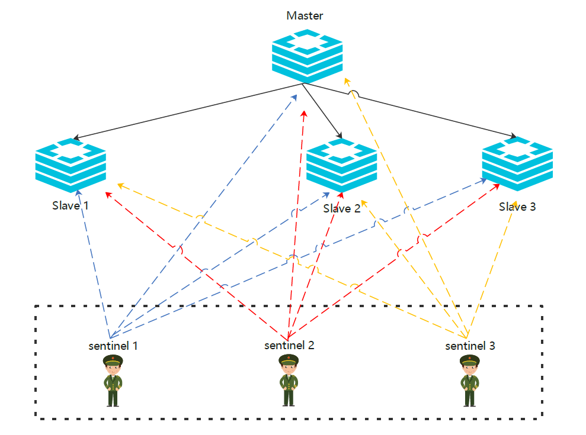
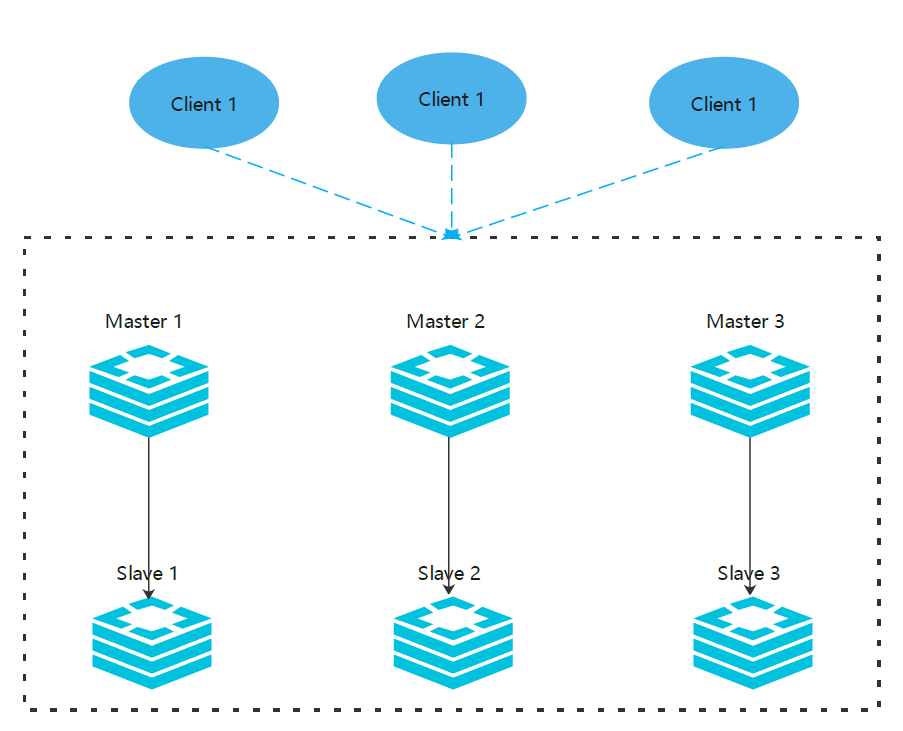

[toc]

## Redis相关

### Redis概述

Redis是C语言编写的一个 K-V 型的非关系型数据库，但是其数据是存储在内存中而非磁盘中的，所以读写非常快。读的速度是每秒大概11w次，写的速度是每秒大概8w多次。


### Redis数据类型

**各数据类型底层实现原理：**https://xie.infoq.cn/article/98c984f6462aec99ffc0c3b42

#### String（字符串）

String 类型，即字符串类型。也支持对数字类型的字符串进行增减操作

**常用命令**

- set get：无需多说，设置值和取值
- setnx：如果不存在，才设置；存在，则不执行任何操作
- setex：设置值并且设置过期时间，例如 setex a 10 a，设置key为a，value为a，有效时间10秒
- getset：设置值并且返回旧值。如果存在旧值，修改旧值并返回旧值；如果没有旧值，设置值并返回nil
- mset：批量设置
- mget：批量获取

**底层实现**

1. <font color=red>使用整数值实现的字符串对象</font>
2. <font color=red>使用 embstr 编码的动态字符串实现的字符串对象：</font>从 Redis 3.0 版本开始，字符串引入了 embstr 编码方式，长度小于 39（Redis 3.2 之后是44） 的字符串将以 EMBSTR 方式存储。
3. <font color=red>动态字符串（**SDS**）实现的字符串对象：</font>Redis 自己构建的一种名为简单动态字符串（simple dynamic string，SDS）的抽象类型，并将 SDS 作为 Redis 的默认字符串表示。

#### Hash（散列表）

Redis hash 是一个 string 类型的 field（字段） 和 value（值） 的映射表，hash 特别适合用于存储对象。

Redis 中每个 hash 可以存储 (2<<32) - 1 键值对（40多亿）。

**常用命令**

- hset hget
- ...

**底层实现**

1. ziplist（压缩列表）
2. dict（字典）

#### List（列表）

Redis 列表是简单的字符串列表，按照插入顺序排序。你可以添加一个元素到列表的头部（左边）或者尾部（右边）。

一个列表最多可以包含 （2<<32） - 1 个元素 (4294967295, 每个列表超过40亿个元素)。

**常用命令**

- lpush rpush：分别从左边，右边添加元素，可以添加多个。例如 rpush key value1 value2...
- lrange：获取索引范围内的值。例如 lrange key 0 3。0和3分别代表初始索引和结束索引，-1代表最后一个索引
- lindex：获取指定索引的值。例如 lindex key 1。表示获取索引为1的值
- lpop rpop：分别从左边，右边弹出（删除）当前第一个值。例如 rpop key
- blpop brpop：分别从左边，右边弹出（删除）当前第一个值，如果没有值，等待超时。例如 brpop key1 key2 10
- llen：获取列表的元素个数（长度）。例如 llen key
- lrem：移除列表指定元素。例如 lrem key 1 aaa。表示移除索引为1的值”aaa“
- rpoplpush：移除列表的最后一个元素，并将该元素添加到另一个列表并返回。例如 rpoplpush key1 key2

**底层实现**

- **Redis3.2之前**

  - ziplist（压缩列表）：需要连续的内存空间
  - linkedlist（双链表）

  默认使用 ziplist，当列表元素个数超过512或者单个元素的长度超过64时，ziplist 会转换成 linkedlist。

  512和64都可以通过配置文件修改，如下：

  ```text
  list-max-ziplist-value 64
  list-max-ziplist-entries 512
  ```

- **Redis3.2之后**

  - quickList

  统一使用 quicklist 实现，可以认为 quickList，是 ziplist 和 linkedlist 二者的结合；quickList 将二者的优点结合起来。

  quickList 是一个 ziplist 组成的双向链表，每个节点使用 ziplist 来保存数据。

#### Set（无序集合）

Redis 的 Set 是 String 类型的无序集合。集合成员是唯一的，这就意味着集合中不能出现重复的数据。

**常用命令**

- sadd：添加元素，可添加多个。例如 sadd key value1 value2
- smembers：获取集合所有元素。例如 smembers key
- sismember：查看集合中是否存在该元素。例如 sismember key value
- scard：获取集合中元素个数。例如 scard key
- srem：删除集合中某个元素。例如 srem key value
- sinter：获取两个集合的交集。例如 sinter key1 key2
- sunion：获取两个集合的并集。例如 sunion key1 key2
- sdiff：获取两个集合的差集。例如 sdiff key1 key2，可获得 key1集合 - key2集合 结果

**底层实现**

<font color=red>底层通过**整数集合**和**字典**两种方式来实现。</font>

如果集合同时满足如下两个条件，则采用整型数组；否则，采用字典实现：

1. **Set 集合中的所有元素都为整数**
2. **Set 集合中的元素个数不大于 512（默认 512，可以通过修改 set-max-intset-entries 配置调整集合大小）**


#### ZSet（Sorted Set 有序集合）

Redis 有序集合和集合一样也是 string 类型元素的集合,且不允许重复的成员。

不同的是每个元素都会关联一个 double 类型的分数，redis 正是通过分数来为集合中的成员进行从小到大的排序。

有序集合的成员是唯一的，但分数(score)可以重复。

**常用命令**

- zadd：添加元素到集合，可批量添加。例如 zadd key 1 value1 2 value2，这里的1和2分别代表对应 value 的分数
- zcard：获取集合中元素个数
- zcount：获取集合在指定分数区间的元素个数。例如 zcount key 1 2
- zincrby：给集合中指定元素的分数执行增加操作。例如 zincrby key [increment] value，表示给 value 元素的分数增加 increment
- zscore：返回集合中指定元素的分数。例如 zscore key value
- zinterstore：获取多个集合的交集，并将交集结果放入新的集合。例如 `zinterstore newKey 2 key1 key2`，表示获取集合 key1和集合 key2 的交集，并将结果存储在新的集合 newKey 上。这里求2个集合的交集，所以第3个参数是2，如果求3个集合交集，则第三个参数是3，以此类推。
- zrank：获取集合指定元素的索引。例如 zrank key value，表示返回集合 key 中 value 的索引。
- zrange：获取集合指定索引区间的元素。例如 zrange key start end [可选参数 withscores]。start 和 end 分别表示分数起止区间，可选参数 withscores 如果加上，则会连同元素分数一起返回。
- zrangebyscore：获取指定分数区间的元素。例如 zrangescore key start end  [withscores] limit start end，通过limit可获取指定返回的元素个数，类似于分页。
- zrem：移除集合中的一个或多个元素。例如 zrem key value1 value2...
- zremrangebyscore：移除集合中给定分数区间的元素。例如 zremrangebyscore key start end
- zrevrank：返回集合中指定元素的排名
- zunionstore：计算给定的一个或多个集合的并集，并存储在新的集合中。例如 zunionstore newKey keysNum key1 key2...

**底层实现**

<font color=red>Zset 底层同样采用了两种方式来实现，分别是 ZipList 和 SkipList（跳表）。</font>当同时满足以下两个条件时，采用 ZipList 实现；反之采用 SkipList 实现。

1. **Zset 中保存的元素个数小于 128。（通过修改 zset-max-ziplist-entries 配置来修改）**
2. **Zset 中保存的所有元素长度小于 64 byte。（通过修改 zset-max-ziplist-values 配置来修改）**

**ZipList实现：**

和 List 的底层实现有些相似，对于 Zset 不同的是，其存储是以键值对的方式依次排列，键存储的是实际 value，值存储的是 value 对应的分值。

**SkipList实现：**

SkipList 分为两部分，dict 部分是由字典实现，Zset 部分使用跳跃表实现，从图中可以看出，dict 和跳跃表都存储的数据，实际上 dict 和跳跃表最终使用指针都指向了同一份数据，即数据是被两部分共享的，为了方便表达将同一份数据展示在两个地方。


### Redis持久化

<font color=red>redis 作为缓存，为了解决宕机带来的数据丢失问题，增加了持久化机制。</font>

<font color=red>Redis 支持 RDB 和 AOF 两种持久化机制，持久化功能有效地避免因进程退出造成的数据丢失问题，当下次重启时利用之前持久化的文件即可实现数据恢复。</font>

#### RDB（Redis DataBase）

- 默认情况下，只开启 RDB。RDB 是二进制文件。

- RDB 方式也叫快照方式，这种方式会在一定的触发时机下，将当前 redis 的内存快照保存到磁盘上的 dump.rdb 文件中。

  这个过程中，主要执行一个命令`bgsave`。如下图：

  


**RDB持久化流程解析**

1. 在一定的条件下触发`bgsave`执行。
2. Redis 父进程判断当前是否存在正在执行的子进程，如 RDB/AOF 子进程，如果存在`bgsave`命令直接返回。
3. 如果不存在，父进程执行 fork 操作创建子进程，fork 操作过程中父进程会阻塞，不能响应其他客户端请求。通过`info stats`命令查看 latest_fork_usec 选项，可以获取最近一个 fork 操作的耗时，单位为微秒。Fork 的作用是复制一个与当前进程一样的进程。新进程的所有数据（变量、环境变量、程序计数器等）数值都和原进程一致，但是是一个全新的进程，并作为原进程的子进程。
4. 父进程 fork 完成后，`bgsave`命令返回“Background saving started”信息并不再阻塞父进程，可以继续响应其他客户端命令。
5. 子进程创建 RDB 文件 dump.rdb，根据父进程内存生成临时快 RDB 文件。
6. 使用临时 RDB 文件对原有 RDB 文件的原子替换。执行`lastsave`命令可以获取最后一次生成 RDB 的时间，对应 info 统计的 rdb_last_save_time 选项
7. 子进程退出。

**触发机制**

<font color=red>触发 RDB 持久化过程分为**手动触发**和**自动触发**。</font>

- 手动触发：通过`redis-cli`登录 redis 后，可以使用`save`和`bgsave`两个命令触发 RDB 持久化。

  - `save`命令（已废弃）：阻塞当前 Redis 服务器，直到 RDB 过程完成为止，对于内存比较大的实例会造成长时间阻塞，线上环境不建议使用。
  - `bgsave`命令：Redis 进程执行 fork 操作创建子进程，RDB 持久化过程由子进程负责，完成后自动结束。阻塞只发生在 fork 阶段，一般时间很短。

  <font color=red>显然 bgsave 命令是针对 save 阻塞问题做的优化。因此 Redis 内部所有的涉及 RDB 的操作都采用 bgsave 的方式，而 save 命令已经废弃。</font>

- 自动触发：需要配置 redis.conf 配置文件，具体配置文件请看下面的相关配置

  - 满足下面配置文件中`save m n`的触发条件时，redis 会自动执行`bgsave`。
  - slave 全量复制 master 时，会发信息给 master，这时 master 会执行`bgsave`，执行完成之后会将 rdb 文件发送给 slave。
  - 执行`shutdown`和`flushall`命令时，redis 会自动执行`bgsave`。

  可以在 redis-cli 的命令行执行`config set save " "`关闭 RDB 的持久化机制。

**配置文件（redis.conf）**

```java
################################ SNAPSHOTTING  ################################
#900s内，如果至少有一个key进行了修改，就进行持久化操作
save 900 1
#300s内，如果至少有10个key进行了修改，就进行持久化操作
save 300 10
#60s内，如果至少有10000个key进行了修改，就进行持久化操作
save 60 10000
#持久化如果出错，是否还需要继续工作
stop-writes-on-bgsave-error yes
#是否压缩rdb文件，需要消耗一些cpu资源
rdbcompression yes
#保存rdb文件的时候,进行错误的检查校验
rdbchecksum yes
#持久化的文件名字
dbfilename dump.rdb
#rdb文件保存的目录
dir /usr/local/redis/data/
```

**数据恢复**

rdb 文件会自动恢复。在 redis 客户端命令行通过`config get dir`获取 redis 的安装目录，然后将备份文件 (dump.rdb) 移动到 安装目录并启动服务即可，redis 就会自动加载文件数据至内存了。

Redis 启动后会读取 RDB 快照文件，将数据从硬盘载入到内存。根据数据量大小与结构和服务器性能不同，这个时间也不同。RDB 本身是二进制文件，恢复非常快。通常将一个记录一千万个字符串类型键、大小为 1GB 的快照文件载入到内存中需要花费 20～30 秒钟。 


#### AOF（Append Only File）

默认情况下，aof 是关闭的。AOF 命令写入的内容直接是文本协议格式，可以通过 vim 查看文件内容。

**原理：**

以独立日志的方式记录每次写命令，重启时再重新执行 AOF 文件中的命令达到恢复数据的目的。<font color=red>AOF 的主要作用是解决了数据持久化的**实时性**，目前已经是 Redis 持久化的主流方式</font>。掌握 AOF 持久化机制，对兼顾数据安全性和性能非常有帮助。通俗一点的理解就是以日志的形式来记录每个**写操作**，将 Redis 执行过的所有写指令记录下来（读操作不记录），只许追加文件但不可以改写文件，redis 启动之初会读取该文件重新构建数据，换言之，redis 重启的话就根据日志文件的内容将写指令从前到后执行一次以完成数据的恢复工作。

**AOF持久化流程解析**

AOF 的持久化有三步

1. 命令写入（append）
2. 文件同步（sync）
3. 文件重写（rewrite）

如下图所示



1. 所有的写入命令会追加到 aof_buf（缓冲区）中。
2. AOF 缓冲区根据对应的策略向硬盘做同步操作。
3. 随着 AOF 文件越来越大，需要定期对 AOF 文件进行重写，达到压缩的目的。

**Rewrite 原理 :** AOF 文件持续增长而过大时，会 fork 出一条新进程来将文件重写(也是先写临时文件最后再 rename)。遍历新进程的内存中数据，每条记录有一条的 Set 语句。重写 aof 文件的操作，并没有读取旧的 aof 文件，而是将整个内存中的数据库内容用命令的方式重写了一个新的 aof 文件，这点和快照有点类似。

**触发机制**

AOF 的 appendfsync 触发机制取决于配置文件如何配置，主要由三个参数决定：no、always、everysec。可以根据对性能和持久化的实时性要求，具体配置。如果不知道哪种合适，就使用默认的 everysec，可能会有 1s 的数据丢失。如下配置文件所示。

<font color=red>aof 文件的重写过程的触发，由下面配置的 rewrite 参数决定。可以手动触发和自动触发。</font>

- 手动触发：通过`redis-cli`登录 redis 后，可以使用`bgrewriteaof`命令触发 aof 的重写机制。
- 自动触发：根据 `auto-aof-rewrite-min-size` 和 `auto-aof-rewrite-percentage` 参数确定自动触发时机，当两个条件同时满足时，就会触发重写。


**配置文件（redis.conf）**

```java
############################## APPEND ONLY MODE ###############################
# 默认不开启aop持久化机制，因为RDB对于一般的业务已经够用了
appendonly no

# aof持久化文件名称
appendfilename "appendonly.aof"

# 不执行sync, 完全依赖操作系统的刷写，一般30秒一次。性能最好，但是持久化没有保障，不推荐
# appendfsync no
    
# 每次有写命令执行，就会执行一次sync，将命令追加到aof日志文件。保证完全持久化，不会丢数据，性能也是最差的，不推荐
# appendfsync always
    
# 每秒钟执行一次sync，将命令追加到aof日志文件。在性能和持久化之间做了折中，推荐。也是默认配置
appendfsync everysec

# 默认不会对aof文件使用BGREWRITEAOF命令进行重写（重写会合并命令，减小aof文件占用的空间）
no-appendfsync-on-rewrite no
    
# 当aof文件占用的空间超过上一次记录的100%时，并且aof文件每增加64M，就会执行重写（两个条件同时满足）
auto-aof-rewrite-percentage 100
auto-aof-rewrite-min-size 64mb

# 加载aof文件时，如果文件本身有问题（如文件结尾），是否继续加载。
  yes:继续加载，no:加载出现错误，停止加载，需要修复aof文件后才能加载，这时不能重启redis
aof-load-truncated yes
```

这里需要注意的是触发 sync 的配置和 rewrite 的配置。

**数据恢复**

<font color=red>redis 启动时，首先判断 aof 功能是否开启，如果开启并且存在 aof 持久化文件，则只会使用 aof 文件进行数据恢复，而不会使用 rdb 文件进行数据恢复。</font>

如下图所示：



AOF其他说明：

- 使用 aof 文件恢复时，AOF 文件可能存在结尾不完整的情况，比如机器突然掉电导致 AOF 尾部文件命令写入不全。Redis 为我们提供了 `aof-load-truncated` 配置来兼容这种情况，默认开启。加载 AOF 时，当遇到此问题时会忽略并继续启动。

- 如果关闭 aof-load-truncated 配置，当 aof 文件不完整时，则 redis 会启动失败，这时使用客户端连接也是失败的。

- 对于错误格式的 AOF 文件，可以先进行备份，然后采用 redis 安装目录下的`redis-check-aof`命令修复 aof 文件，修复后使用 linux 的命令`diff -u`对比数据的差异，找出丢失的数据，有些可以人工修改补全。如下所示：

```java
[root@redis ~]# redis-check-aof --fix appendonly.aof
0x             a4: Expected \n\r, got:6461
AOF analyzed: size=185, ok_up_to=139, diff=46
This will shrink the AOF form 185 bytes, with 46 bytes, to 139 bytes
Continue? [y/N]: y # 输入y，同意修改
Successfully truncated AOF
[root@redis ~]#
```


#### RDB和AOF对比

- 数据完整性方面，AOF 可以做到最多只丢失1秒的数据甚至仅丢失1个写操作的数据，RDB 则可能会丢失当前到上一次写入时候的数据。所以，单论数据完整性，AOF 肯定更好，但是其性能消耗显然更高。
- 性能消耗方面：毋庸置疑，AOF 会带来持续的 IO。一般而言，RDB 足够用了。
- 数据恢复方面：单论恢复速度，RDB 是二进制文件，AOF 是日志文件，RDB 文件会更小，且二进制数据恢复起来肯定更快。


### Redis为什么那么快

- 首先，Redis 是基于内存操作的，读写操作一般是不涉及磁盘 IO 的，两者之间差了好几个数量级，这是 redis 快的基础。
- 其次，Redis 采用了**IO多路复用的线程模型**。
- 此外，其高效的数据结构和合理的数据编码也是不可或缺的原因。
- 最后，Redis 真正的读写操作都是单线程的（Redis6.0加了多线程），避免了线程间切换的竞争的资源消耗。

这里重点对 Redis 的**<font color=red>IO多路复用线程模型</font>**做一下介绍：

- 这里的“多路”指的是多个网络连接（客户端连接），“复用”指的是复用同一个线程处理多个网络连接。采用多路 I/O 复用技术可以让单个线程高效的处理多个客户端的网络IO连接请求（尽量减少网络 IO 的时间消耗）。

- **Redis 基于 Reactor 模式开发了自己的网络事件处理器，这个处理器被称为文件事件处理器 file event handler。**由于这个文件事件处理器是单线程的，所以 Redis 才叫做单线程的模型，但是它采用 IO 多路复用机制可以同时监听多个 Socket，并根据 Socket 上的事件来选择对应的事件处理器进行处理。<font color=red>文件事件处理器的结构包含4个部分：</font>

   ```java
   1.多个Socket（套接字）
   2.IO多路复用程序
   3.文件事件分派器（dispatcher）
  4.事件处理器（命令请求处理器、命令回复处理器、连接应答处理器）
  ```

  线程模型如下图:

  

  **IO多路复用处理器工作流程**：

  多个 Socket 可能会产生不同的操作，每个操作对应不同的文件事件，但是 IO 多路复用程序会监听多个 Socket，将 Socket 产生的事件放入队列中排队，事件分派器每次从队列中取出一个事件，把该事件交给对应的事件处理器进行处理。
  
  Redis 客户端对服务端的每次调用都经历了发送命令，执行命令，返回结果三个过程。其中执行命令阶段，由于 Redis 是单线程来处理命令的，所有每一条到达服务端的命令不会立刻执行，所有的命令都会进入一个队列中，然后逐个被执行。并且多个客户端发送的命令的执行顺序是不确定的。但是可以确定的是不会有两条命令被同时执行，不会产生并发问题，这就是 Redis 的单线程基本模型。

**实现原理：**<font color=red>多路 I/O 复用模型是利用 **Linux 下的 select、poll、epoll** 可以同时监察多个流的 I/O 事件的能力，在空闲的时候，会把当前线程阻塞掉，当有一个或多个流有 I/O 事件时，就从阻塞态中唤醒，然后程序就会轮询一遍所有的流（**epoll 是只轮询那些真正发出了事件的流**），并且依次顺序的处理就绪的流，这种做法就避免了大量的无用操作。</font>


### Redis如何实现附近的人

自 Redis 3.2 开始，Redis 基于 GEOHASH 和有序集合提供了地理位置相关功能。

#### Redis GEO相关命令

- **geoadd：**将给定的位置对象（纬度、经度、名字）添加到指定的 Key。可一次性添加多个

  - 使用示例：geoadd key longitude latitude member [longitude latitude member ...]

- **geopos：**从 Key 里面返回所有给定对象的位置（经度和纬度）。

  - 使用示例：geopos key member [member ...]

- **geodist：**返回两个给定位置之间的距离。

  - 示例：geodist key member1 member2 [unit]  	unit：单位，m km mi(英里) ft(英尺)

- **geohash：**返回一个或多个位置对象的GeoHASH 字符串表示。

  - 使用示例：key member [member ...]

- **geoardius：**以给定的经纬度为中心，返回目标集合中与中心的距离不超过给定最大距离的所有位置对象。

  - 使用示例：geoardius key longitude latitude radius m|km|ft|mi [WITHCOORD] [WITHDIST] [WITHHASH] [COUNT count]

    - `WITHCOORD`: 将位置元素的经度和维度也一并返回。
    - `WITHDIST`: 在返回位置元素的同时， 将位置元素与中心之间的距离也一并返回。 距离的单位和用户给定的范围单位保持一致。
    - `WITHHASH`: 以 52 位有符号整数的形式， 返回位置元素经过原始 geohash 编码的有序集合分值。 这个选项主要用于底层应用或者调试， 实际中的作用并不大。
    - `COUNT`：获取前N个匹配的元素。

    命令默认返回未排序的位置元素，可通过ASC或者DESC指定被返回位置元素的排序方式。

- **geoardiusbymember：**以给定的位置对象为中心，返回与其距离不超过给定最大距离的所有位置对象。

  - 使用示例：geoardiusbymember key member radius m|km|ft|mi [WITHCOORD] [WITHDIST] [WITHHASH] [COUNT count]

#### 实现原理

<font color=red>geo 相关命令底层是通过**zset（有序集合）**实现的。</font>

通过geohash对经纬度进行编码，编码过程如下（简述）：

1. 使用二分法生成二进制数据：
   1. 将纬度（-90,90）分成两个区间，（-90,0）和（0,90），如果目标纬度落在左边区间则记为 0，否则记为 1；再将目标纬度所在的那个区间在通过二分法分成两个相等的区间，如果目标纬度落在左边区间则记为 0，否则记为 1，以此类推；
   2. 将经度按照同样的方式进行处理；
   3. 最终，分别得到一个由 0 和 1 组成的二进制。
2. 合并二进制数据：将第1步得到的两个二进制按照 **“偶数位放经度，奇数位放纬度”** 的原则，进行合并。
3. 将第2步得到的二进制转换成10进制。
4. 将第3步得到的10进制进行 base32 编码，得到一个字符串，就是经过 geohash 计算得到的值。


<font color=red>使用 **GeoHash** 编码后，相当于把整个地球地理空间划分成了一个个方格，每个方格对应了 **GeoHash** 中的一个分区。</font>


### 缓存击穿 缓存穿透 缓存雪崩 

**什么是缓存击穿？**

指的是某个热点数据缓存失效的时候，突然涌入大批量的请求直接打到了数据库，可能导致数据库直接挂掉。

**解决办法**

- 设置更长的缓存失效时间，这样能减少缓存击穿发生的概率。
- 不设置失效时间，这样带来的问题就是数据库和缓存的数据一致性会差的多一点。
- 对该热点数据的请求加分布式锁，限制每次只能一个请求可以进来，从数据库获取结果之后，再把缓存设置回去。

**什么是缓存穿透？**

指的是请求进来没有命中缓存数据，请求直接打到了数据库。个别的可以忍受，但是如果有黑客恶意攻击，故意查询不存在的数据是无法容忍的。比如根据id查询订单，恶意发送查找id为负数的请求。

**解决办法**

- 对不存在的数据设置空缓存，但是过期时间必须设置比较短，因为可能会产生该数据，导致查询为空。
- 布隆过滤器，过滤器恶意攻击请求。

**什么是缓存雪崩？**

指的是某个时刻，缓存大面积过期失效或者 redis 挂了，导致大量请求直接打到了数据库，可能造成数据库挂掉的情况。

**解决办法**

- 不同的缓存设置不一样的过期时间，避免同一时间大量缓存同时失效。
- 针对 redis 挂了导致的缓存雪崩，可设置 redis 集群。


### Redis分布式锁

#### Redis分布式锁简介

Redis分布式锁是针对分布式，集群环境下的

**分布式锁特点**

- 互斥性：任意时刻，只能有一个客户端持有锁
- 锁超时释放：持有锁超时可以释放，避免无谓的资源浪费以及死锁问题
- 独占性：锁只能被持有的客户端删除释放，不能被其他客户端释放
- 高可用行：分布式场景下，一小部分服务器宕机不影响正常使用，所以需要以集群的方式部署分布式锁

#### Redis分布式锁实现

实现方式有多种，如下

1. jedis
   - 加锁：
   - 解锁
2. Redission

​		Redission 看门狗机制


### Redis高可用

<font color=red>**高可用**HA（High Availability）是分布式系统架构设计中必须考虑的因素之一，它通常是指，通过设计减少系统不能提供服务的时间。</font>

如果在实际开发中，redis 只部署了一个实例（节点），假如该实例挂了，那么整个服务都会变得不可用，这就是**单点故障**。

那么，如何实现 Redis 的高可用呢？

这里讨论3中模式：

1. **主从复制模式**
2. **哨兵模式**
3. **集群模式**

#### 1. Redis主从复制模式

**主从模式介绍**

<font color=red>Redis 之所以能实现主从模式，是因为 redis 提供了复制功能，当一个redis节点的数据发生变化时，能把这个变化自动同步到其他redis节点。</font>

鉴于此，redis 可以部署多个节点（多台redis服务器），然后把这些节点分成两类：

- master节点（主节点）
- slave节点（从节点）

<font color=red>默认情况下，每个redis节点都是主节点，一个主节点可以有多个从节点，但是一个从节点只能有一个主节点。</font>这就是所谓的一主多从结构。如下图：





上面说到每个节点默认都是主节点，那么，如果设置从节点呢，也就是如何设置redis节点之间的主从关系呢？这就需要我们修改配置文件了，一般是 redis.conf 文件。

**主节点配置**

正常配置即可

**从节点配置**

修改redis从节点的对应的配置文件 redis.conf

```java
# 配置主节点的ip和端口
slaveof 192.168.1.10 6379
# 从redis2.6开始，从节点默认是只读的
slave-read-only yes
# 假设主节点有登录密码，是123456 如果没有 无需配置此选项
masterauth 123456
```

如果不配置上述文件的话，可以在节点启动后通过命令行设置主节点，如下

`slaveof 192.168.1.10 6379`

该命令的意思是，设置192.168.1.10 6379节点作为当前节点的主节点，当前节点则为其从节点。

配置完毕，先启动主节点，然后启动从节点即可。

**主从复制流程**



如上图所示（**全量复制**）：

1. 主从库建立连接、协商同步的过程，主要是为全量复制做准备。

   从库给主库发送 psync 命令，表示要进行数据同步，主库根据这个命令的参数来启动复制。psync 命令包含了**主库的 runID 和复制进度 offset 两个参数**。

   - runID，是每个 Redis 实例启动时都会自动生成的一个随机 ID，用来唯一标记这个实例。当从库和主库第一次复制时，因为不知道主库的 runID，所以将 runID 设为 “?”。
   - offset，此时设为 -1，表示第一次复制。主库收到 psync 命令后，会用 FULLRESYNC 响应命令带上两个参数：**主库 runID 和主库目前的复制进度 offset，返回给从库**。

   **FULLRESYNC** 响应表示第一次复制采用的全量复制，也就是说，主库会把当前所有的数据都复制给从库。

2. 主库执行 bgsave 命令，生成 RDB 文件，发送给从库。从库收到后，先清空自己的数据（避免主从不一致），在本地完成数据加载。

   主库在将数据同步给从库的过程中，仍然可以正常接收请求。但是，这些请求中的写操作并没有记录到刚刚生成的 RDB 文件中。

   为了保证主从一致性，主库会在内存中用 **replication buffer** 记录 RDB 文件生成后收到的所有写操作。

3. 主库会把 replication buffer 中的修改操作发给从库，从库再重新执行这些操作。如此，主从就实现了同步。

**主从复制优缺点**

**优点：**

- 基于主从复制可进行读写分离操作，可有效应对大规模的并发读操作
- 从节点之间可相互接口连接和同步请求，能有效的分担主节点的同步压力
- 主从同步是以非阻塞的方式进行，同步期间不会影响客户单的读写请求

**缺点：**

- 主从节点的数据都是一样的，即数据冗余。降低了内存的可用性，内存是比较宝贵的资源
- 主从模式不具备自动容错以及恢复功能，如果主节点挂了会导致无法写入，从节点挂了会导致该从节点无法提供读服务。需要手动重启，人工处理才能让其恢复正常。
- 较难支持在线扩容，当容量达到上限，在线扩容非常复杂。


**增量复制：**环形缓冲区实现，如果主库写的命令超过了（覆盖）从库断开时读到的位置，则只能进行全量复制了。

环形缓冲区的大小可通过配置文件设置：**repl_backlog_size**


#### 2. 哨兵模式

**哨兵模式介绍**

哨兵其实就是一个运行在特殊模式下的 Redis 进程，主从库实例运行的同时，它也在运行。哨兵主要负责的就是三个任务：监控、选主（选择主库）和通知。

主从模式最明显的缺点就是不具备容错性，主节点挂机需要人工手动处理，重新设置主节点。费时费力，且期间会造成服务不可用，实际生产环境并不推荐主从模式，优先考虑哨兵模式。

<font color=red>在哨兵模式下，主节点宕机，哨兵会自动选举主节点并将其他的从节点指向新的主节点。</font>

在主从模式下，redis 同时提供了哨兵命令`redis-sentinel`，<font color=red>哨兵是一个独立的进程，作为进程，它会独立运行。其原理是哨兵进程向所有的 redis 机器发送命令，等待 Redis 服务器响应，从而监控运行的多个 Redis 实例。</font>

哨兵可以有多个，一般为了便于决策选举，使用奇数个哨兵。哨兵可以和 redis 机器部署在一起，也可以部署在其他的机器上。<font color=red>多个哨兵构成一个哨兵集群，哨兵之间也会相互通信，检查哨兵是否正常运行，同时发现 master 宕机，哨兵之间会进行决策选举新的 master，</font>如下图所示：



**哨兵工作流程：**

1. 通过发送命令，让 Redis 服务器返回监控其运行状态，包括主服务器和从服务器；
2. 当哨兵监测到 master 宕机，会自动将 slave 切换到 master，然后通过**发布订阅模式**通知其他的从服务器，修改配置文件，让它们切换主机；
3. 但是仅一个哨兵进程对 Redis 服务器进行监控，有可能会出现问题，为此，我们可以使用多个哨兵进行监控。各个哨兵之间还会进行监控，这样就形成了多哨兵模式（集群）。

**哨兵模式配置**

```java
# 关闭保护模式
protected-mode no

# sentinel monitor [master-group-name] [ip] [port] [quorum]
# 该行的意思是：监控的master的名字叫做mymaster （可以自定义），地址为192.168.88.111:6379，行尾最后的一个2代表在sentinel集群中，多少个sentinel认为master死了，才能真正认为该master不可用了。
sentinel monitor mymaster 192.168.88.111 6379 2
```

可以看到哨兵配置非常简单，哨兵实例之间可以相互发现，要归功于 Redis 提供的 pub/sub 机制，也就是发布 / 订阅机制。

哨兵只要和主库建立起了连接，就可以在主库上发布消息了，比如说发布它自己的连接信息（IP 和端口）。同时，它也可以从主库上订阅消息，获得其他哨兵发布的连接信息。当多个哨兵实例都在主库上做了发布和订阅操作后，它们之间就能知道彼此的 IP 地址和端口。
在主从集群中，主库上有一个名为`__sentinel__:hello` 的频道，不同哨兵就是通过它来相互发现，实现互相通信的。

**哨兵模式优缺点**

**优点：**

- 哨兵模式是基于主从模式的，主从模式的优点，哨兵模式都有
- 主节点故障可实现自动处理，选举新的主节点，系统更健壮，可用性更高

**缺点：**

- 具有主从模式的缺点，每个 redis 节点数据都是一致的，内存资源利用率不高
- 在线扩容同样麻烦复杂


#### 3. 集群模式

**集群模式介绍**

Redis 哨兵模式虽然可实现主从复制，读写分离。但是每个 redis 节点的数据都是一样的，比较浪费内存。针对这个问题，就有了 redis 集群。

Redis 集群模式（Cluster）实现了数据分片和分布式存储，每个 redis 节点的数据都是不一样的，没有中心化的节点。

Redis 集群模式机构如下：



这里的 6 台 redis 两两之间并不是独立的，每个节点都会通过集群总线(cluster bus)，与其他的节点进行通信（PING-PONG机制）。

**集群配置**

首先，需要启动至少6个 redis 节点，3主3从。

之后，借助 `redis-tri.rb` 工具可以快速的部署集群。

`redis-trib.rb create --replicas 1` xxx.xxx.xxx.xxx:6379 xxx.xxx.xxx.xxx:6380 ...
后面跟上 redis 节点的ip和端口号。

- **添加新的主节点：**

  - 首先得启动一个新的redis节点，然后执行 `redis-trib.rb add-node 192.168.17.168:7004 192.168.17.168:7001` 命令

    - `192.168.17.168:7004` 表示添加的新节点，`192.168.17.168:7001` 表示集群中任一旧节点

  - 添加成功后，查看集群状态：`cluster nodes`，可以看到新节点的id以及哈希槽信息，但是哈希槽是空的，尚未分配哈希槽

  - 所以，接下来需要为新节点分配哈希槽：`./redis-trib.rb reshard 192.168.17.168:7001`

    - `192.168.17.168:7001`表示集群中任一旧主节点

      执行过程：

      1. How many slots do you want to move (from 1 to 16384)? 1000 \#输入1000表示要移动1000个哈希槽

      ​	2.What is the receiving node ID?  输入节点id #把这1000个哈希槽给谁呢？输入7004节点对应的id

      ​	3.all   输入all表示从所有的哈希槽拥有者中抽取1000个给7004节点
      
      ​			   输入某个节点的id表示 从该节点上拿1000个 给7004这个节点 然后再执行done命令

- **添加新的从节点：**

  - 同样，先启动一个新的节点
  - 然后，执行`./redis-trib.rb add-node --slave --master-id 339a50df26f4722f14faba2a8fe3cad508059e88 192.168.17.168:7005 192.168.17.168:7001`
    - --slave：表示添加的是从节点
    - --master-id：339a50df26f4722f14faba2a8fe3cad508059e88，主节点的 node id，这个id是7001的节点id，表示将新节点添加为7001的从节点
    - 192.168.17.168:7005：新增的从节点
    - 192.168.17.168:7001：集群任一个旧节点

- **修改从节点的主节点：**

  -  连接要修改的从节点：`./redis-cli -h 192.168.17.168 -p 7005 -c` 
  - 移动到新的主节点：`cluster replicate 3dd56b46572e1d1c1edece5e73ff4edf54485b09`
    - 3dd56b46572e1d1c1edece5e73ff4edf54485b09：新的主节点的节点id

- **删除从节点：**

  - 直接删除就可以了：`./redis-trib.rb del-node 192.168.17.168:7005 081057b99f96b02ecad64ce6e4ab92c9d494a170`
    - del-node：表示删除节点
    - `192.168.17.168:7005`：表示要删除的从节点
    - 081057b99f96b02ecad64ce6e4ab92c9d494a170：表示要删除的从节点的节点id

- **删除主节点：**

  - 如果主节点有从节点，将从节点转移到其他主节点；
  - 如果主节点有 slot，去掉分配的 slot，然后再删除主节点。
    - 这里说明一下如何移除 solt，其实就是重新分配哈希槽的过程，把待删除主节点的 solt 全部移到其他节点，done
  - 最后，执行上面的删除节点操作：`./redis-tri.rb del-node 待删除节点(host:port) 待删除处节点id`

执行上述新增或者删除 Redis 节点后，Redis 需要重新分配哈希槽。此时，实例之间还可以通过相互传递消息，获得最新的哈希槽分配信息，但是，客户端是无法主动感知这些变化的。这就会导致，它缓存的分配信息和最新的分配信息就不一致了，那该怎么办呢？

Redis Cluster 方案提供了一种<font color=red>**重定向机制**</font>，所谓的 “重定向”，就是指，客户端给一个实例发送数据读写操作时，这个实例上并没有相应的数据，客户端要再给一个新实例发送操作命令。

如果客户端发送请求到 Redis 集群中的一个实例时，该实例并没有该键值对映射的哈希槽，那么这个实例就会返回一个 **MOVED** 命令，并带上新实例的地址。

```java
GET key(error) 
MOVED 13320 172.16.19.5:6379
```

其中，MOVED 命令表示，客户端请求的键值对所在的哈希槽 13320，实际是在 172.16.19.5 这个实例上。通过返回的 MOVED 命令，就相当于把哈希槽所在的新实例的信息告诉给客户端了。这样一来，客户端就可以直接和 172.16.19.5 连接，并发送操作请求了。


此外还有一种情况，只完成了部分数据的迁移。在这种迁移部分完成的情况下，客户端就会收到一条 ASK 报错信息，如下所示：

```java
GET key(error) 
ASK 13320 172.16.19.5:6379
```

这个结果中的 ASK 命令就表示，客户端请求的键值对所在的哈希槽 13320，在 172.16.19.5 这个实例上，但是这个哈希槽正在迁移。此时，客户端需要先给 172.16.19.5 这个实例发送一个 ASKING 命令。这个命令的意思是，让这个实例允许执行客户端接下来发送的命令。然后，客户端再向这个实例发送 GET 命令，以读取数据。

ASK 命令表示两层含义：第一，表明 Slot 数据还在迁移中；第二，ASK 命令把客户端所请求数据的最新实例地址返回给客户端，此时，客户端需要给最新实例发送 ASKING 命令，然后再发送操作命令。

**集群模式优缺点**


